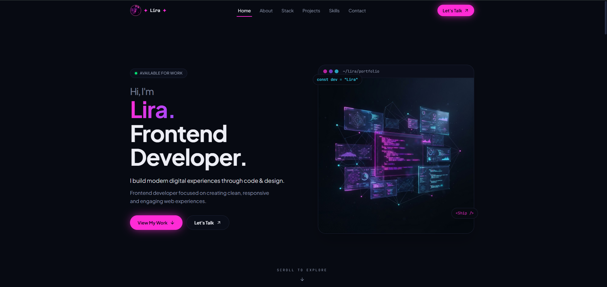
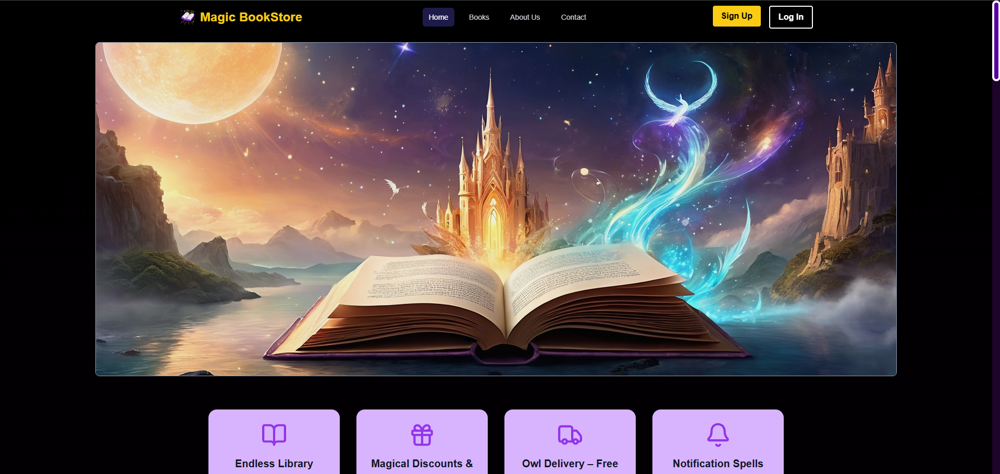
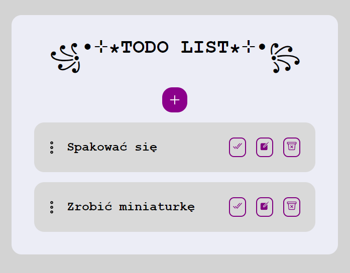

<div align="center">

# ✦ LIRA ✦

### Frontend Developer Portfolio

**Building modern digital experiences through code & design.**

<br />

<p align="center">
  <a href="https://lira-frontend-developer-portfolio.vercel.app/">
    
  </a>
  &nbsp;&nbsp;
  <a href="https://github.com/Tygrys11/Lira-Frontend-Developer-Portfolio">
    
  </a>
</p>
<br /><br />



</div>

---

<div align="center">

### `DESIGN` · `DEVELOPMENT` · `EXPERIENCE`

</div>

---

## ◈ About

**Lira** is my personal Frontend Developer portfolio — a place where I showcase the projects I build, the technologies I work with and my approach to modern web development.

I wanted the portfolio itself to be more than a collection of links. Every part of the interface is designed to demonstrate the skills I use when building real products:

* thoughtful UI
* responsive layouts
* reusable components
* smooth interactions
* motion and micro-interactions
* clean architecture
* attention to detail

> **The goal was simple: build a portfolio that is itself a demonstration of my frontend skills.**

---

## ✦ What Defines Lira

<table>
<tr>
<td width="50%">

### 🎨 Design First

Clean interfaces built around typography, spacing, hierarchy and visual consistency.

</td>
<td width="50%">

### ⚡ Motion

Subtle animations and transitions powered by Framer Motion to add depth without distracting from the content.

</td>
</tr>

<tr>
<td width="50%">

### 🧩 Component Driven

Reusable React components keep the interface modular, maintainable and easier to extend.

</td>
<td width="50%">

### 📱 Responsive

Designed to provide a consistent experience across desktop, laptop, tablet and mobile.

</td>
</tr>

<tr>
<td width="50%">

### 🛠️ Real Projects

The portfolio showcases real projects, each with its own technologies, features and development goals.

</td>
<td width="50%">

### 🧠 Always Evolving

Lira continues to grow alongside my skills, experiments and new projects.

</td>
</tr>
</table>

---

# ⚙️ Tech Stack

<div align="center">

### Core


### Styling & Motion


### UI & Tools


### Analytics


</div>

---

# 🧠 Architecture

Lira follows a component-driven structure designed to keep individual sections focused and reusable.

```text
app/
│
├── layout.tsx
├── page.tsx
└── globals.css

components/
│
├── ui/
│   └── button.tsx
│
├── about.tsx
├── ambient-background.tsx
├── brand-icons.tsx
├── contact.tsx
├── footer.tsx
├── hero.tsx
├── navbar.tsx
│
├── projects.tsx
├── project-card.tsx
├── project-modal.tsx
│
├── skills.tsx
├── tech-stack.tsx
├── section-label.tsx
├── scroll-progress.tsx
│
├── project-card-wordpressP.tsx
├── project-modal-wordpressP.tsx
└── wordpressProjects.tsx

lib/
│
├── motion.ts
├── untils.ts
├── Wordpressprojects.ts
└── projects.ts
```

Project data is separated from the presentation layer in `lib/projects.ts`, while shared animation variants are centralized in `lib/motion.ts`.

This keeps the UI components focused on presentation and makes common behaviours easier to reuse.

---

# ✦ Selected Work

## 01 / LiraStudioYT

### Mine-imator Portfolio

A dedicated portfolio created for a Minecraft animator and YouTube creator.

**Built with**

`Next.js` · `React` · `TypeScript` · `Tailwind CSS` · `Framer Motion`

**Highlights**

* Mine-imator project showcase
* YouTube content presentation
* animated sections
* responsive interface
* reusable components
* contact functionality

<div align="center">


<br /><br />

<p>
  <a href="https://lirastudioyt-mine-imator-portfolio.vercel.app/">
    
  </a>
  &nbsp;&nbsp;
  <a href="https://github.com/Tygrys11/LiraStudioYT-Mineimator-Portfolio">
    
  </a>
</p>

</div>

---

## 02 / Magic BookStore

### Online Bookstore

A larger application focused on building a more complex e-commerce experience with authentication, user accounts, shopping functionality and an administration dashboard.

**Built with**

`Next.js` · `React` · `TypeScript` · `Tailwind CSS` · `Firebase` · `Clerk` · `NextAuth` · `Framer Motion`

**Highlights**

* book catalogue
* book details
* shopping cart
* authentication
* user profiles
* orders
* category management
* analytics dashboard
* account settings
* responsive UI

<div align="center">



<br /><br />

<a href="https://magic-book-store.vercel.app/">
  
</a>
&nbsp;
<a href="https://github.com/Tygrys11/MagicBookStore">
  
</a>

<br /><br />

**🚧 Work in Progress**

</div>

---

## 03 / To-Do List

### Task Management Application

A lightweight task management application built with React and Vite, focused on component architecture and interactive UI development.

**Built with**

`React` · `Vite` · `Ionic React` · `Ionicons`

**Highlights**

* task creation
* task management
* interactive interface
* reusable components
* responsive layout

<div align="center">



<br /><br />

<a href="https://to-do-list-planning.netlify.app/">
  
</a>
&nbsp;
<a href="https://github.com/Tygrys11/ToDo-List">
  
</a>

</div>

---

# 🎞️ Motion & Interaction

Motion is an important part of Lira's visual identity.

Animations are intentionally subtle and are used to guide attention and improve the overall feel of the interface.

The project uses Framer Motion for:

* entrance animations
* staggered content
* hover interactions
* project transitions
* floating elements
* scroll-based animations

Shared animation variants are centralized in:

```text
lib/motion.ts
```

---

# 👨‍💻 About Me

I'm a Frontend Developer focused on building modern, responsive and engaging web experiences.

My main focus is:

**React · Next.js · TypeScript · Tailwind CSS**

I enjoy combining development and design to create interfaces that are both technically solid and visually polished.

I'm continuously learning, experimenting and turning new ideas into real projects.

---

# 🤝 Let's Work Together

Have an idea for a website or application?

I'm open to:

`Freelance Projects` · `Frontend Development` · `Collaborations` · `Creative Web Projects`

You can reach me through my portfolio.

---

<div align="center">

<br />

### ✦ LIRA

**Built with Next.js, React, TypeScript & a lot of ☕**

<br />

<a href="https://lira-frontend-developer-portfolio.vercel.app/">
  
</a>

</div>
